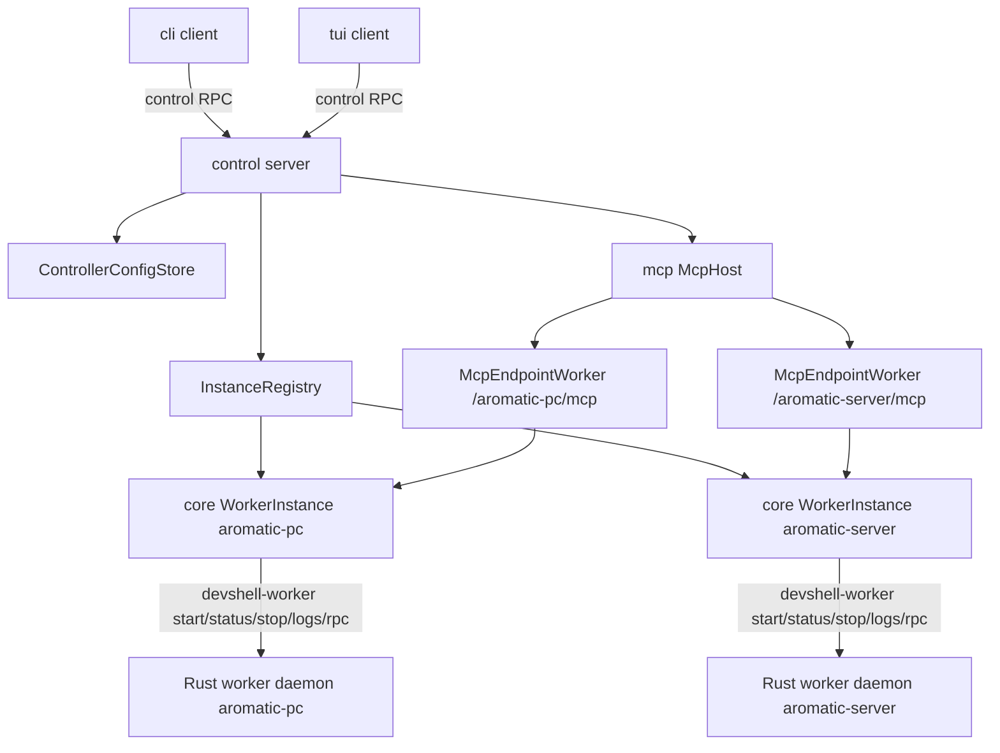
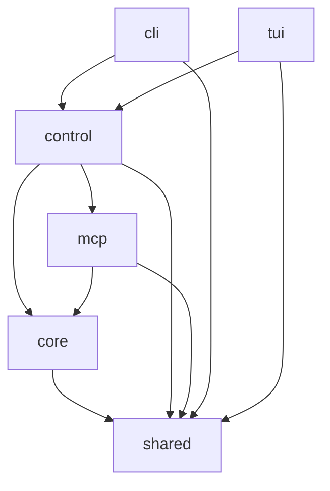
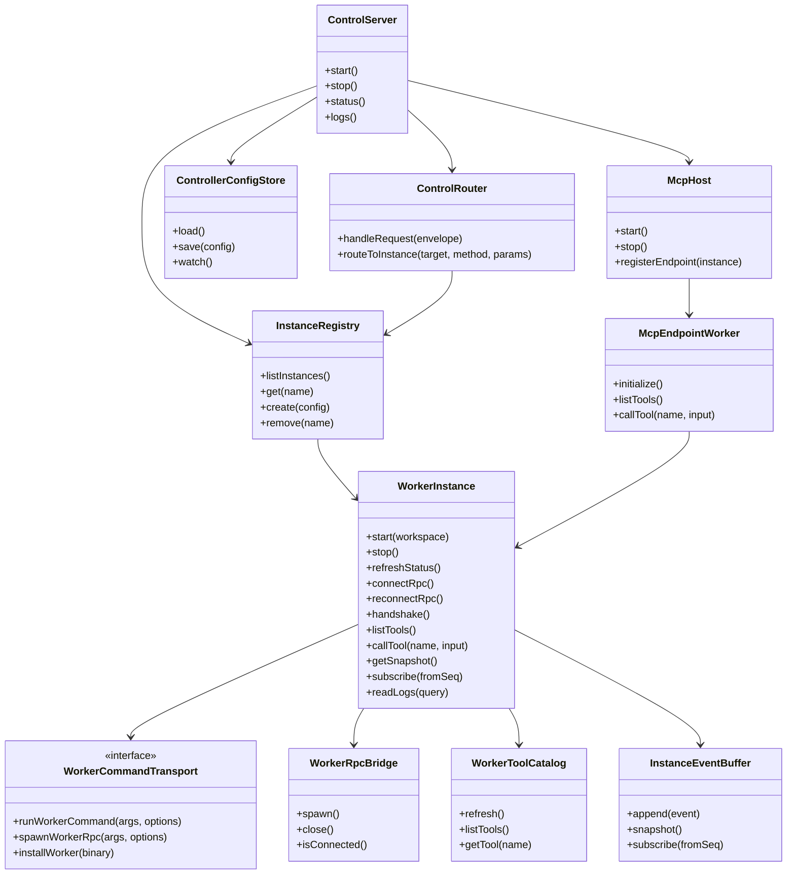
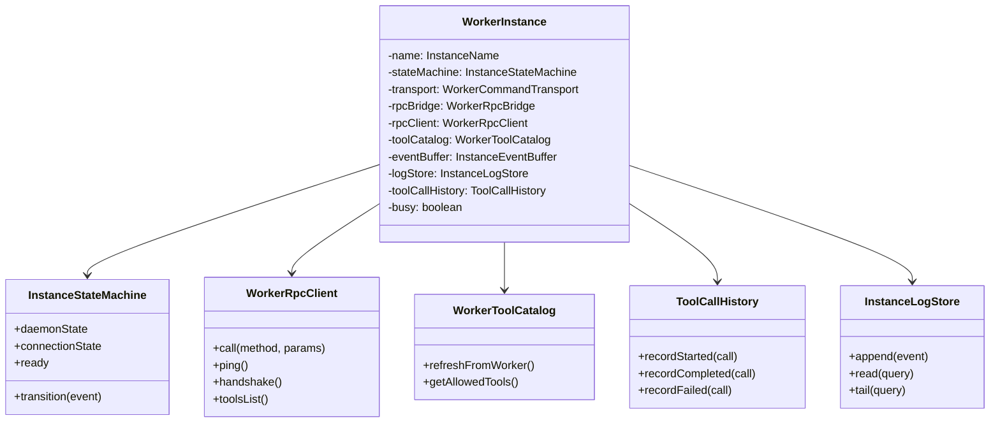

# portable-devshell TS 端设计文档（历史归档）

> [!WARNING]
> 这是 2026-07-07 的 0.1 冻结设计归档，仅用于追溯早期决策。当前配置、MCP 工具面、反向连接、Artifact、Todo、OAuth 和调度模型请以 [当前架构](../architecture.md) 及其他现行文档为准。

版本：0.1 冻结版
日期：2026-07-07
范围：TypeScript 主程序、control server、core instance runtime、MCP host、CLI、TUI 及其通信协议。
依赖：Rust `devshell-worker` 已冻结为 Docker-like self-running daemon + exec/RPC control model。

---

## 1. 设计目标

TS 端不再按“多个入口各自实现状态逻辑”的方式推进，而是固定为：

```text
control 是长期运行的 TS control server。
core 是单个 worker instance 的运行核心。
mcp 模块集中运行多个 per-instance MCP endpoint。
cli/tui 是 control client。
```

核心目标：

```text
1. CLI/TUI/MCP 不再各自读取文件系统、拼 worker 命令、判断状态。
2. 单个 instance 的状态、连接、工具 schema、日志、history 全部归 core。
3. 多 instance 的持有、配置分发、生命周期入口、CLI/TUI 路由归 control。
4. MCP 是工具暴露运行面，不是 instance 管理控制面。
5. CLI/TUI 只做 UI 和聚合，不拥有真实数据源。
6. 跨进程协议、状态机、路径布局、鉴权和持久化必须先冻结，再实现。
```

---

## 2. 总体拓扑



最终数据流：

```text
CLI/TUI 管理流：
  cli/tui -> control server -> core.WorkerInstance -> devshell-worker

MCP 工具流：
  /<instance_name>/mcp -> mcp.McpEndpointWorker -> core.WorkerInstance -> worker RPC tool

配置流：
  control config file -> control -> core.WorkerInstanceConfig / mcp endpoint config

日志流：
  worker/core event -> core instance-local log/event buffer -> control per-instance route -> cli/tui

全局聚合流：
  cli/tui -> 多个 per-instance pull/stream -> cli/tui 本地 merge/sort/filter/render
```

---

## 3. 模块依赖关系

### 3.1 依赖方向



依赖约束：

```text
shared 不依赖任何业务模块。
core 不依赖 control/mcp/cli/tui。
control 依赖 core 和 mcp，但只负责 wiring 和控制平面，不进入 MCP 工具调用数据面。
mcp 可以依赖 core 的窄接口，用于绑定 WorkerInstance。
cli/tui 只依赖 control，不直接依赖 core/mcp 的运行能力。
```

### 3.2 禁止依赖

```text
禁止 cli -> fs 读取真实配置/日志/状态。
禁止 tui -> fs 读取真实配置/日志/状态。
禁止 cli/tui -> core 直接 new WorkerInstance。
禁止 cli/tui -> devshell-worker 直接 spawn。
禁止 mcp 暴露 control 的 instance 管理接口。
禁止 core 依赖 mcp。
禁止 control 实现 worker RPC frame/bridge/tool call 细节。
```

---

## 4. 模块职责

## 4.1 shared

`shared` 只保存跨模块共享的类型、DTO、schema 和错误码。

允许：

```text
InstanceName
WorkspacePath
ControllerConfig DTO
InstanceConfig DTO
ControlEnvelope DTO
ControlError DTO
InstanceSnapshot DTO
InstanceEvent DTO
ToolDefinition DTO
ToolCallRecord DTO
McpConfig DTO
AuthConfig DTO
```

禁止：

```text
读文件
spawn 进程
连接 socket
启动 HTTP server
维护状态
业务流程编排
```

---

## 4.2 core

`core` 是单个 instance 的运行核心。

一句话职责：

```text
core 负责如何控制一个 WorkerInstance。
```

`core` 拥有：

```text
WorkerInstance
WorkerCommandTransport
WorkerRpcBridge
WorkerRpcClient
WorkerProtocolClient
WorkerToolCatalog
InstanceStateMachine
InstanceEventBuffer
InstanceLogStore
ToolCallHistory
instance-local structured persistence
```

`core` 负责：

```text
1. 安装/定位 worker binary。
2. 通过 provider 在目标环境执行 devshell-worker 命令。
3. 以 cwd 方式启动 worker start。
4. 长期持有 devshell-worker rpc bridge。
5. worker RPC bridge 断开后自动重连。
6. 重连后重新 worker.ping / worker.handshake / tools.list。
7. 缓存 worker tool schema。
8. 转发 tool call 到 worker RPC。
9. 维护 daemonState / connectionState / ready。
10. 维护 per-instance event seq。
11. 维护 per-instance structured log event buffer。
12. 持久化 per-instance logs/history/events。
13. 提供 readLogs / streamLogs / getSnapshot / subscribeEvents。
```

`core` 不负责：

```text
1. 读取 TS control 全局配置文件。
2. 管理多个 instance。
3. 做全局聚合。
4. 暴露 MCP server。
5. 处理 CLI/TUI 渲染。
6. 处理 OAuth / publicBaseUrl / ChatGPT Connector。
```

---

## 4.3 control

`control` 是 TS 端控制平面 server。

一句话职责：

```text
control 负责持有多个 WorkerInstance，并服务 CLI/TUI 控制请求。
```

`control` 拥有：

```text
ControlServer
ControlRouter
InstanceRegistry
ControllerConfigStore
ControlLifecycleManager
ControlRpcServer
McpWiringService
```

`control` 负责：

```text
1. 长期运行 control server。
2. 维护 control socket/pid/log。
3. 读取 TS 端配置。
4. 校验配置。
5. 创建/持有 core WorkerInstance。
6. 将配置分发给 core WorkerInstance。
7. 将配置分发给 mcp McpHost。
8. 注册 /<instance_name>/mcp endpoint。
9. 路由 CLI/TUI 请求到具体 WorkerInstance。
10. 提供 per-instance pull snapshot。
11. 提供 per-instance stream subscription。
12. 提供 control 自身 start/stop/status/logs 能力，由 CLI 调用。
```

`control` 不负责：

```text
1. 不进入 MCP 工具调用数据面。
2. 不做全局 logs/toolCalls/timeline 聚合。
3. 不读取 worker raw log 文件细节。
4. 不实现 worker RPC frame codec。
5. 不直接执行 bash_run。
6. 不直接 spawn ssh/docker/podman。
```

---

## 4.4 mcp

`mcp` 是 MCP 工具暴露模块。

一句话职责：

```text
mcp 集中运行多个 per-instance MCP endpoint，每个 endpoint 一对一绑定一个 WorkerInstance。
```

`mcp` 拥有：

```text
McpHost
McpEndpointWorker
McpToolSchemaAdapter
McpDescriptionEnhancer
McpAuthMiddleware
McpOAuthProvider
McpConnectorAdapter
```

`mcp` 负责：

```text
1. 监听 MCP HTTP endpoint。
2. 支持 /<instance_name>/mcp 路由。
3. 每个 endpoint 绑定一个 core WorkerInstance。
4. MCP session 内 tool name 保持 worker 原始工具名，例如 bash_run。
5. tools = worker tools.list schema ∩ 配置 allowlist。
6. description 由 mcp 模块增强。
7. 支持 listenHost/listenPort/publicBaseUrl 配置。
8. 支持鉴权配置。
9. 公网暴露时强制鉴权。
10. 后续 OAuth 2.1 / ChatGPT Connector 属于 mcp 模块职责。
```

`mcp` 不负责：

```text
1. 不暴露 instances.list/start/stop/status/config/logs。
2. 不读取 logs。
3. 不读取 tool call history。
4. 不做 instance 管理。
5. 不做全局聚合。
6. 不持有多个 MCP session 并发操作同一个 instance。
```

---

## 4.5 cli

`cli` 是命令行 UI 层。

职责：

```text
1. control server start/stop/status/logs。
2. 解析命令行参数。
3. 连接 control server。
4. 一次性命令使用 pull。
5. watch/logs -f 类命令使用 stream。
6. 自己做全局聚合和输出格式化。
7. 返回 exit code。
```

禁止：

```text
1. 不直接读 ~/.devshell 下的配置/状态/logs。
2. 不直接 spawn devshell-worker。
3. 不直接连接 worker daemon socket。
4. 不直接调用 core WorkerInstance。
5. 不把全局聚合下沉到 control。
```

---

## 4.6 tui

`tui` 是交互式 UI 层。

职责：

```text
1. 启动时连接 control server。
2. 首次初始化使用 pull。
3. 后续状态/log/tool events 使用 stream push。
4. 维护 UI state / view model。
5. 自己做多 instance 聚合、排序、过滤、展示。
6. 处理 tab、sidebar、keymap、panel、tool audit box。
```

禁止：

```text
1. 不直接读配置文件。
2. 不直接读 worker.log。
3. 不直接 spawn worker。
4. 不直接连接 worker RPC。
5. 不要求 control 返回 global timeline/global logs/global tool calls。
```

---

## 5. 建议目录结构

```text
packages/
  shared/
    src/
      types/
      dto/
      errors/
      schemas/
      protocol/

  core/
    src/
      instance/
        WorkerInstance.ts
        WorkerInstanceFactory.ts
        InstanceStateMachine.ts
        InstanceSnapshot.ts
      provider/
        WorkerCommandTransport.ts
        LocalWorkerTransport.ts
        SshWorkerTransport.ts
        DockerWorkerTransport.ts
        PodmanWorkerTransport.ts
      worker/
        WorkerRpcBridge.ts
        WorkerRpcClient.ts
        WorkerProtocolClient.ts
        WorkerCommandClient.ts
      tools/
        WorkerToolCatalog.ts
        WorkerToolInvoker.ts
      logs/
        InstanceLogStore.ts
        InstanceEventBuffer.ts
        ToolCallHistory.ts
      protocol/
        FrameCodec.ts
        RpcEnvelope.ts

  control/
    src/
      server/
        ControlServer.ts
        ControlLifecycleManager.ts
        ControlRpcServer.ts
      router/
        ControlRouter.ts
        RouteTarget.ts
      instances/
        InstanceRegistry.ts
      config/
        ControllerConfigStore.ts
      mcp/
        McpWiringService.ts

  mcp/
    src/
      host/
        McpHost.ts
      endpoint/
        McpEndpointWorker.ts
      tools/
        McpToolSchemaAdapter.ts
        McpDescriptionEnhancer.ts
      auth/
        McpAuthMiddleware.ts
        OAuthProvider.ts
      connector/
        ChatGPTConnectorAdapter.ts

  cli/
    src/
      commands/
      render/
      main.ts

  tui/
    src/
      app/
      screens/
      components/
      keymap/
      view-model/
      main.ts
```

---

## 6. 类图

### 6.1 总体类关系



### 6.2 core WorkerInstance 内部类图



---

## 7. 文件系统布局

### 7.1 control server 布局

control server 必须使用 `~/.devshell`，但不得与 worker instance 布局冲突。

固定路径：

```text
~/.devshell/
  control/
    config.toml
    logs/
      control.log
    state/
      control.pid
    events/
      control-events.jsonl

$XDG_RUNTIME_DIR/
  portable-devshell/
    control.sock
```

说明：

```text
1. ~/.devshell/control/ 是 TS control server 专属目录。
2. control 不是合法 worker instance name，因为 worker instance name 必须至少包含一个 '-'.
3. control.sock 放在 XDG_RUNTIME_DIR，不放入 ~/.devshell。
4. control.pid 是辅助状态，不是 control 是否可用的最终判据。
5. control 是否可用以 control RPC ping/status 成功为准。
```

### 7.2 per-instance TS core structured storage

worker 已经占用：

```text
~/.devshell/<instance_name>/
  config.toml
  logs/
    worker.log
  state/
    worker.pid
```

TS core 的 instance-local structured storage 必须在同一个 instance 垂直目录内，但不得覆盖 worker 文件：

```text
~/.devshell/<instance_name>/
  control-worker/
    events.jsonl
    tool-calls.jsonl
    logs.jsonl
```

说明：

```text
worker.log 是 Rust worker raw log。
events.jsonl 是 TS core 结构化 instance event log。
tool-calls.jsonl 是 TS core instance-local tool call history。
logs.jsonl 是 TS core 结构化 log event persistence。
```

禁止：

```text
~/.devshell/instances/
~/.devshell/logs/
~/.devshell/sessions/
```

---

## 8. control server 生命周期

### 8.1 CLI 控制命令

TS control server 生命周期由 CLI 命令管理：

```text
devshell start
devshell stop
devshell status
devshell logs
```

这些命令控制的是 TS control server，不是 Rust worker daemon。

### 8.2 control 缺失行为

```text
cli/tui 连接 control server 失败时：
  报错
  不自动拉起 control
  提示用户执行 devshell start
```

### 8.3 control 启动行为

control 启动时：

```text
1. 创建 ~/.devshell/control/。
2. 读取 ~/.devshell/control/config.toml。
3. 初始化 InstanceRegistry。
4. 根据配置创建 WorkerInstance 对象。
5. 初始化 McpHost。
6. 注册配置中启用的 /<instance_name>/mcp endpoint。
7. 创建 $XDG_RUNTIME_DIR/portable-devshell/control.sock。
8. 写入 control.pid。
9. 等待 control RPC ping/status 可用。
```

control 启动时禁止：

```text
1. 不自动 start 所有 worker instance。
2. 不自动恢复 stopped worker。
3. 不自动恢复 stale worker。
4. 不主动执行 bash_run。
```

---

## 9. control RPC 协议

### 9.1 Transport

```text
Transport: Unix socket
Socket: $XDG_RUNTIME_DIR/portable-devshell/control.sock
Frame: 4-byte big-endian length + JSON payload
Field naming: camelCase
Error: structured error
Connection: reusable
```

沿用 length-prefixed JSON frame，禁止 newline JSON。

### 9.2 Frame

```text
[4-byte big-endian length][JSON payload]
```

建议：

```text
MAX_FRAME_SIZE = 16 MiB
```

### 9.3 Request Envelope

Envelope 必须方便路由到 control 或具体 instance。

```json
{
  "type": "request",
  "id": "req-1",
  "target": {
    "kind": "instance",
    "instance": "aromatic-pc"
  },
  "method": "instance.getSnapshot",
  "params": {}
}
```

control target：

```json
{
  "type": "request",
  "id": "req-2",
  "target": {
    "kind": "control"
  },
  "method": "control.status",
  "params": {}
}
```

### 9.4 Response Envelope

成功：

```json
{
  "type": "response",
  "id": "req-1",
  "ok": true,
  "result": {}
}
```

失败：

```json
{
  "type": "response",
  "id": "req-1",
  "ok": false,
  "error": {
    "code": "control.instanceNotFound",
    "message": "Instance not found.",
    "retryable": false,
    "details": {
      "instance": "aromatic-pc"
    }
  }
}
```

### 9.5 Event Envelope

```json
{
  "type": "event",
  "seq": 42,
  "target": {
    "kind": "instance",
    "instance": "aromatic-pc"
  },
  "event": "toolCall.completed",
  "payload": {}
}
```

### 9.6 Error Body

```json
{
  "code": "string",
  "message": "string",
  "retryable": false,
  "details": {}
}
```

---

## 10. control RPC 方法

### 10.1 control methods

```text
control.ping
control.status
control.shutdown
control.listInstances
```

### 10.2 instance methods

```text
instance.getSnapshot
instance.start
instance.stop
instance.refreshStatus
instance.readLogs
instance.subscribe
instance.callTool
```

### 10.3 禁止方法

control 禁止提供全局聚合方法：

```text
control.getAllInstancesSnapshot
control.getMergedTimeline
control.getGlobalLogs
control.getGlobalToolCalls
control.searchAllLogs
control.searchAllToolCalls
```

CLI/TUI 必须逐个 instance 查询，然后自己聚合。

---

## 11. pull + stream push 协议

### 11.1 基本规则

```text
1. CLI/TUI 首次初始化使用 pull。
2. 后续更新使用 stream push。
3. stream 使用 control RPC 复用连接。
4. 每个 instance 维护独立递增 seq。
5. snapshot 必须返回 lastSeq。
6. subscribe 必须携带 fromSeq。
7. 如果 fromSeq 太旧或 event buffer 缺失，返回 gap，客户端重新 pull。
```

### 11.2 初始化流程

```text
1. tui -> control: control.listInstances
2. tui -> control: instance.getSnapshot(instance=A)
3. control -> tui: snapshot + lastSeq
4. tui -> control: instance.subscribe(instance=A, fromSeq=lastSeq+1)
5. control/core 补发 fromSeq 之后的事件
6. 后续持续推送 event
```

### 11.3 gap 处理

当 fromSeq 无法补发：

```json
{
  "type": "response",
  "id": "sub-1",
  "ok": false,
  "error": {
    "code": "stream.gap",
    "message": "Requested event sequence is no longer available. Pull a fresh snapshot.",
    "retryable": true,
    "details": {
      "instance": "aromatic-pc",
      "requestedFromSeq": 100,
      "oldestAvailableSeq": 130
    }
  }
}
```

客户端行为：

```text
收到 stream.gap 后必须重新 instance.getSnapshot，然后用新的 lastSeq 订阅。
```

---

## 12. WorkerInstance 状态模型

状态必须拆成双轴：

```text
daemonState:
  stopped | starting | running | stale | stopping | failed

connectionState:
  disconnected | connecting | connected | reconnecting | failed
```

`ready` 是派生状态：

```text
ready =
  daemonState == running
  && connectionState == connected
  && worker.handshake 已成功
  && tools.list 已成功
```

语义：

```text
running 只表示 worker daemon RPC 可响应。
ready 表示 TS core 已完成 handshake + tools.list，可以调用工具。
stale 是 daemonState，不是 connectionState。
```

stale 定义：

```text
worker.ping 失败 + pid/socket/runtime files 存在 => stale
worker.ping 失败 + 无 runtime files => stopped
worker.ping 成功 => running
```

core 不自动恢复 stale。只有用户显式 start instance 时，才允许由 worker start 执行 stale 清理和重启。

---

## 13. core -> worker RPC bridge

### 13.1 长连接模型

每个 WorkerInstance 长期持有一个 `devshell-worker rpc --instance <name>` 子进程。

```text
WorkerInstance
  -> WorkerRpcBridgeProcess
    -> devshell-worker rpc --instance <name>
      -> worker daemon Unix socket
```

禁止：

```text
禁止每次 tool call 临时 spawn rpc bridge。
禁止 CLI/TUI 直接 spawn devshell-worker rpc。
```

### 13.2 start 流程

```text
WorkerInstance.start(workspace):
  1. transport.runWorkerCommand(["start", "--instance", name], cwd=workspace)
  2. spawn devshell-worker rpc --instance name
  3. worker.ping
  4. worker.handshake
  5. tools.list
  6. refresh WorkerToolCatalog
  7. daemonState = running
  8. connectionState = connected
  9. ready = true
```

### 13.3 reconnect 流程

```text
rpc bridge disconnected:
  1. connectionState = reconnecting
  2. spawn new devshell-worker rpc --instance name
  3. worker.ping
  4. worker.handshake
  5. tools.list
  6. refresh schema cache
  7. connectionState = connected
```

### 13.4 执行中断线

如果 tool call 正在执行时 rpc bridge 断开：

```json
{
  "code": "core.workerRpcDisconnected",
  "message": "Worker RPC bridge disconnected while a tool call was running.",
  "retryable": true,
  "details": {
    "instance": "aromatic-pc"
  }
}
```

---

## 14. 自动启动/恢复策略

冻结规则：

```text
1. control 启动后不自动 start 所有 instance。
2. core 发现 stopped 时不自动 start。
3. core 发现 stale 时不自动恢复。
4. MCP 调用 stopped/not ready instance 时返回错误。
5. TUI 打开 instance 页面时不自动 start。
6. 只有用户显式 start instance 才启动 worker。
```

MCP not ready 错误：

```json
{
  "code": "mcp.instanceNotReady",
  "message": "Instance is not ready for tool calls.",
  "retryable": true,
  "details": {
    "instance": "aromatic-pc"
  }
}
```

---

## 15. MCP 设计

### 15.1 Host

MCP host 可配置监听地址：

```text
listenHost 可配置
listenPort 可配置
publicBaseUrl 必须支持
```

公网规则：

```text
localhost-only 开发模式允许无鉴权。
暴露公网必须启用鉴权。
publicBaseUrl 非 localhost 时，auth.mode = none 非法。
listenHost = 0.0.0.0 时，auth.mode = none 非法。
```

### 15.2 Endpoint

每个 endpoint 一对一绑定一个 WorkerInstance：

```text
/<instance_name>/mcp -> McpEndpointWorker(instance_name) -> WorkerInstance(instance_name)
```

不存在 instance：

```text
返回 404
```

instance 存在但未 ready：

```text
MCP initialize 可以成功。
tools/list 如果 schema cache 可用，可以返回工具。
tools/list 如果 schema 不可用，返回 mcp.toolSchemaUnavailable。
tools/call 返回 mcp.instanceNotReady。
```

### 15.3 Tool schema

MCP 工具统一使用以下定义模型：

```text
ToolDefinition {
  name
  group
  requiredCapabilities[]
  description
  inputSchema
  outputSchema
}
```

worker 工具和 control 工具必须先合并为同一个 catalog。工具名冲突属于 schema 错误，不允许覆盖。合并完成后使用同一条策略过滤：

```text
allTools = workerTools + controlTools
exposedTools = allTools
  where tool.group in instance.mcp.tools.groups
  and every tool.requiredCapabilities in instance.mcp.tools.capabilities
```

`requiredCapabilities = []` 表示该工具只受 group 控制，不需要 capability。不得为某个 control 工具另写绕过统一 catalog 的启用特判。

工具名：

```text
MCP session 内 tool name 保持 worker 原始工具名，例如 bash_run。
不使用 aromatic-pc/bash_run。
不使用 aromatic-pc__bash_run。
```

原因：instance 已由 endpoint path 隔离。

### 15.4 Description

```text
inputSchema 取 worker 返回 schema。
description 由 mcp 模块增强。
```

### 15.5 MCP 禁止暴露内容

MCP 禁止暴露：

```text
instances.list
instances.start
instances.stop
instances.status
config.read
config.update
logs.read
toolCalls.read
control.status
```

MCP 不读取 logs。MCP 没有正常功能需要读取日志。

### 15.6 Session 并发

```text
每个 MCP endpoint 最好是一对一关系。
不支持多个 MCP session 并发操作同一个 instance。
不同 workspace 必须使用不同 instance。
```

---

## 16. MCP 鉴权与 Connector

### 16.1 配置

```toml
[mcp]
enabled = true
listenHost = "127.0.0.1"
listenPort = 17890
publicBaseUrl = "http://127.0.0.1:17890"

[mcp.auth]
mode = "none" # none | token | oauth2
```

公网示例：

```toml
[mcp]
enabled = true
listenHost = "0.0.0.0"
listenPort = 17890
publicBaseUrl = "https://devshell.example.com"

[mcp.auth]
mode = "oauth2"
```

### 16.2 规则

```text
auth.mode = none 仅允许 localhost-only 开发模式。
暴露公网必须鉴权。
OAuth 2.1 属于 mcp 模块职责。
ChatGPT Connector 属于 mcp 模块职责。
Cloudflare Tunnel/publicBaseUrl 相关 URL 生成属于 mcp 模块职责。
control 只读取配置并分发给 mcp。
core 不知道 auth/publicBaseUrl/OAuth/Connector。
```

---

## 17. 日志、事件与 history

### 17.1 归属

```text
core 是 logs 第一站。
core 负责 per-instance structured log buffer。
core 负责 per-instance history 持久化。
control 只路由日志请求和事件流。
cli/tui 负责展示和聚合。
```

### 17.2 文件

```text
~/.devshell/<instance_name>/control-worker/events.jsonl
~/.devshell/<instance_name>/control-worker/tool-calls.jsonl
~/.devshell/<instance_name>/control-worker/logs.jsonl
```

### 17.3 EventBuffer

```text
每个 instance 一个独立 eventSeq。
InstanceEventBuffer 是 ring buffer。
snapshot 返回 lastSeq。
subscribe(fromSeq) 从 buffer 补发。
fromSeq 不可用时返回 stream.gap。
```

### 17.4 事件类型

```text
instance.statusChanged
instance.connectionChanged
instance.readyChanged
worker.rpcConnected
worker.rpcDisconnected
worker.schemaRefreshed
toolCall.started
toolCall.completed
toolCall.failed
log.appended
mcp.sessionOpened
mcp.sessionClosed
mcp.toolCalled
```

### 17.5 tool call history

必须记录：

```text
callId
instance
source: cli | tui | mcp
sessionId 可选
requestId 可选
toolName
input summary
startedAt
completedAt
status: completed | failed
timedOut
exitCode
stdoutBytes
stderrBytes
error code/message/details
```

不允许并发，因此每个 instance 同一时间最多一个 running tool call。

---

## 18. 并发模型

冻结规则：

```text
同一个 WorkerInstance 完全不允许并发 tool call。
maxConcurrentToolCalls = 1。
没有 MCP 多 session 并发。
并发运行需求未来交给 tmux 工具。
```

当 instance busy：

```json
{
  "code": "core.instanceBusy",
  "message": "Instance is already running a tool call.",
  "retryable": true,
  "details": {
    "instance": "aromatic-pc"
  }
}
```

策略：

```text
不排队。
直接返回 busy。
```

理由：当前 worker 不提供 cancel，排队会制造隐藏长任务和不可控等待。

---

## 19. provider / transport 抽象

provider 抽象归 core。

原因：provider 的本质是如何在目标环境执行 worker 命令，以及如何安装 worker binary。这属于 WorkerInstance 建立和控制能力。

接口命名：

```text
WorkerCommandTransport
```

实现：

```text
LocalWorkerTransport
SshWorkerTransport
DockerWorkerTransport
PodmanWorkerTransport
```

接口职责：

```ts
interface WorkerCommandTransport {
  runWorkerCommand(args: string[], options: WorkerCommandOptions): Promise<CommandResult>
  spawnWorkerRpc(args: string[], options: WorkerCommandOptions): Promise<WorkerRpcProcess>
  installWorker?(binary: WorkerBinary): Promise<void>
}
```

control 只做：

```text
读取 provider config -> 构造 WorkerInstanceConfig -> 交给 WorkerInstanceFactory
```

control 禁止直接 spawn ssh/docker/podman。

---

## 20. 配置 schema

### 20.1 control config 路径

```text
~/.devshell/control/config.toml
```

### 20.2 示例

```toml
version = 1

[control]
logLevel = "info"

[mcp]
enabled = true
listenHost = "127.0.0.1"
listenPort = 17890
publicBaseUrl = "http://127.0.0.1:17890"

[mcp.auth]
mode = "none"

[[instances]]
name = "aromatic-pc"
enabled = true
provider = "local"
defaultWorkspace = "/home/user/project"

[instances.mcp]
enabled = true
path = "/aromatic-pc/mcp"
allowTools = ["bash_run"]

[instances.security]
mode = "disabled"

[instances.logs]
eventBufferSize = 1000
retentionDays = 7
```

### 20.3 workspace 规则

worker config 不保存 workspace。worker workspace 只从 `devshell-worker start` 的 cwd 捕获。

TS control config 可以保存 `defaultWorkspace`，但它只用于：

```text
control 调用 core.startInstance 时设置 child process cwd。
```

不得转化为 worker `--workspace` 参数。

---

## 21. CLI 行为

### 21.1 control 生命周期

```text
devshell start
  启动 TS control server

devshell stop
  请求 TS control server 正常退出

devshell status
  查询 TS control server 状态

devshell logs
  读取 TS control server logs
```

### 21.2 instance 操作

```text
devshell instance list
  pull control.listInstances

devshell instance status <instance>
  pull instance.getSnapshot

devshell instance start <instance>
  control -> core -> worker start

devshell instance stop <instance>
  control -> core -> worker stop

devshell instance logs <instance>
  pull instance.readLogs

devshell instance logs <instance> -f
  pull initial logs + stream follow
```

### 21.3 watch

```text
watch 命令显式使用 stream。
普通命令只 pull，不订阅。
```

---

## 22. TUI 行为

TUI 启动：

```text
1. 连接 control server。
2. control 不存在则报错，不自动拉起。
3. pull control.listInstances。
4. 对每个需要展示的 instance 调 instance.getSnapshot。
5. 使用 lastSeq 订阅对应 instance stream。
6. TUI 本地维护 view model。
```

TUI 聚合规则：

```text
首页状态聚合：TUI 本地聚合。
全局 tool audit：TUI 从多个 instance stream 合并。
全局 logs：TUI 从多个 instance stream 合并。
排序、过滤、分组全部在 TUI。
```

control 不提供 global timeline。

---

## 23. 错误码

### 23.1 control

```text
control.notRunning
control.configInvalid
control.instanceNotFound
control.methodNotFound
control.invalidTarget
control.subscriptionGap
```

### 23.2 core

```text
core.workerStartFailed
core.workerStopFailed
core.workerStatusFailed
core.workerRpcDisconnected
core.workerHandshakeFailed
core.toolSchemaUnavailable
core.instanceBusy
core.instanceNotReady
core.providerFailed
```

### 23.3 mcp

```text
mcp.instanceNotFound
mcp.instanceNotReady
mcp.toolNotExposed
mcp.toolSchemaUnavailable
mcp.authRequired
mcp.authInvalid
mcp.publicAuthRequired
```

### 23.4 stream

```text
stream.gap
stream.cancelled
stream.backpressure
```

错误结构统一：

```json
{
  "code": "core.instanceBusy",
  "message": "Instance is already running a tool call.",
  "retryable": true,
  "details": {
    "instance": "aromatic-pc"
  }
}
```

---

## 24. 与 Rust worker 契约的关系

TS 端必须遵守 worker 已冻结契约：

```text
1. worker daemon 生命周期由 worker 自己维护。
2. TS/control 不持有 worker daemon 生命周期。
3. TS/control 通过子进程 cwd 指定 workspace。
4. TS/control 不传 --workspace/--socket/--stdio。
5. core 通过 devshell-worker start/status/stop/logs/rpc 交互。
6. core 通过 devshell-worker rpc 建立 stdio frame bridge。
7. worker.handshake 只做协议和环境协商。
8. tools.list 负责工具发现和 schema。
9. bash_run 是 worker 原始工具名。
10. running 判断以 worker.ping/status RPC 成功为准。
```

---

## 25. 禁止事项

### 25.1 进程拓扑禁止

```text
禁止 cli 自己 new ControlServer。
禁止 tui 自己 new ControlServer。
禁止 mcp 自己 new WorkerInstanceRegistry。
禁止每个入口各自启动一套 runtime。
```

### 25.2 文件系统禁止

```text
禁止 cli/tui 直接读取 ~/.devshell/control/config.toml。
禁止 cli/tui 直接读取 ~/.devshell/<instance>/logs/worker.log。
禁止 cli/tui 直接读取 ~/.devshell/<instance>/control-worker/*.jsonl。
禁止 control 写入 worker config.toml 的 workspace/socket/pidFile。
```

### 25.3 协议禁止

```text
禁止 newline JSON。
禁止不带 target 的 control envelope。
禁止 stream 不带 seq。
禁止 snapshot 不带 lastSeq。
禁止 subscribe 不带 fromSeq。
```

### 25.4 模块职责禁止

```text
禁止 control 做全局聚合。
禁止 control 实现 worker RPC codec。
禁止 mcp 暴露 instance 管理面。
禁止 core 依赖 mcp。
禁止 cli/tui 绕过 control 调 core。
```

### 25.5 并发禁止

```text
禁止同一 WorkerInstance 并发 tool call。
禁止排队隐藏等待。
禁止多 MCP session 并发调用同一 instance。
```

---

## 26. 验收矩阵

### 26.1 阻塞问题

以下属于阻塞：

```text
1. control 不是长期运行 server。
2. cli/tui 会自动拉起 control。
3. cli/tui 直接读取文件系统状态。
4. cli/tui 直接 spawn devshell-worker。
5. control 提供 global logs/global timeline/global tool calls。
6. core 未长期持有 worker rpc bridge。
7. core 自动 start stopped/stale instance。
8. MCP 暴露 instances 控制面。
9. MCP 公网无鉴权。
10. 同一 instance 支持并发 tool call。
11. control RPC 退回 newline JSON。
12. snapshot/stream 不支持 seq/fromSeq。
13. TS storage 与 worker storage 冲突。
14. worker workspace 被写入 worker config。
15. tools schema 不是来自 worker tools.list。
```

### 26.2 非阻塞问题

以下不阻塞：

```text
1. 错误文案可优化。
2. TUI 视觉布局可优化。
3. MCP description 可继续润色。
4. 日志保留策略可调整。
5. 测试覆盖可增加。
6. 内部文件拆分可继续细化。
```

### 26.3 开放设计点规则

未写入本文档的内容均为开放设计点。实现方不得自行将开放设计点实现为强制契约。开放设计点必须先提交用户确认，再进入实现。

---

## 27. 冻结摘要

```text
control:
  长期运行的 TS control server。
  使用 ~/.devshell/control/ 和 $XDG_RUNTIME_DIR/portable-devshell/control.sock。
  读取配置，持有 WorkerInstance，注册 MCP endpoint，路由 CLI/TUI 请求。
  不做全局聚合，不进入 MCP 工具调用数据面。

core:
  单个 instance 的运行核心。
  长期持有 worker rpc bridge。
  维护 daemonState/connectionState/ready、tool schema、logs、history、event buffer。
  不自动 start stopped/stale instance。
  不允许并发 tool call。

mcp:
  集中运行多个 /<instance_name>/mcp endpoint。
  每个 endpoint 一对一绑定 WorkerInstance。
  工具名保持 bash_run。
  schema = worker schema ∩ allowlist。
  description 由 mcp 增强。
  公网必须鉴权。
  OAuth 2.1 / ChatGPT Connector 属于 mcp。

cli/tui:
  只连接 control。
  control 不存在时报错。
  首次 pull，后续 stream。
  自己做全局聚合。

protocol:
  control RPC 使用 Unix socket + 4-byte length-prefixed JSON frame。
  request/response/event envelope 必须带 target。
  per-instance stream 必须有 seq。
  snapshot 必须有 lastSeq。
  subscribe 必须有 fromSeq。
  gap 后重新 pull。
```
